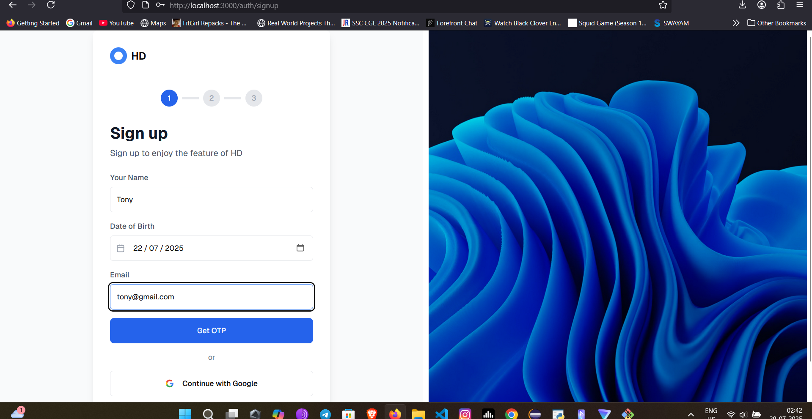
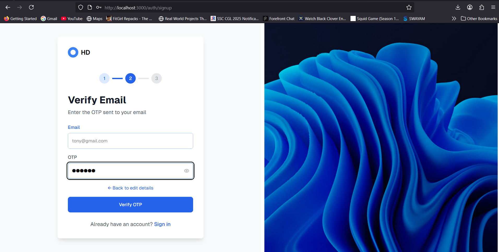
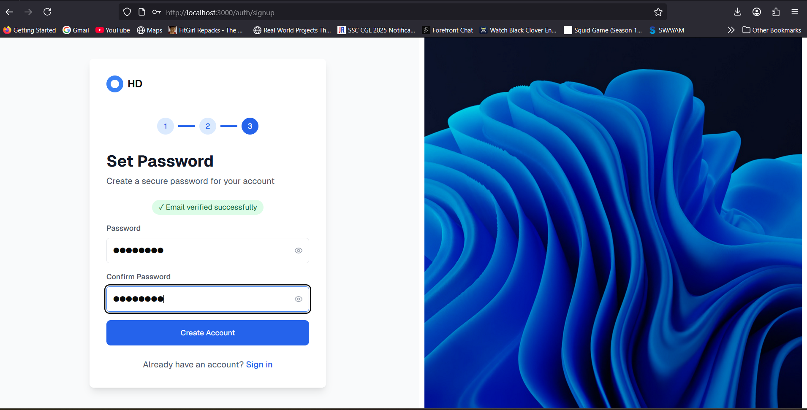
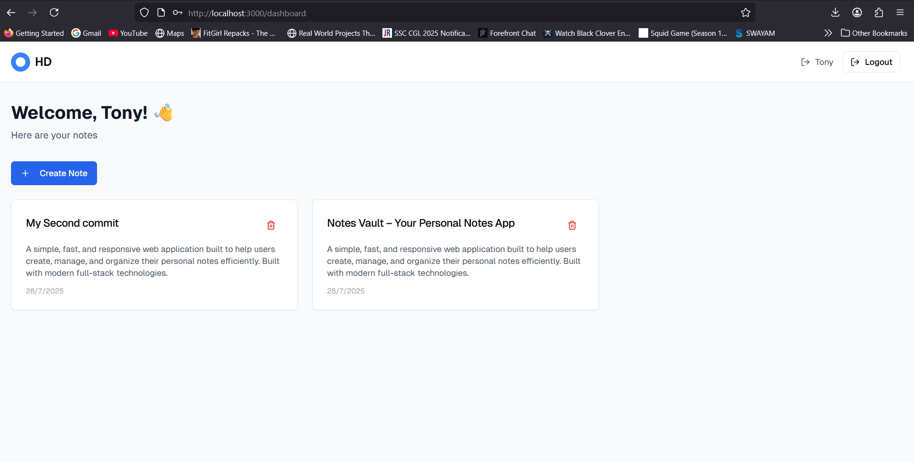

# Notely Notes App

Notely a full-stack note-taking application built with Next.js, TypeScript, and Neon PostgreSQL.

## 🔗 Live Demo

Explore the fully deployed Notely app on Vercel:

👉 [Visit Notely Live on Vercel](https://notely-inky.vercel.app/auth/signin)

> Note: For testing purposes, use the credentials below:
>
> - **Email:** tony@gmail.com  
> - **Password:** Jarvis12 

## Features

- 🔐 **Authentication**: Email/OTP and Google OAuth
- 📝 **Notes Management**: Create, read, and delete notes
- 🔒 **JWT Authorization**: Secure API endpoints
- 📱 **Responsive Design**: Mobile-friendly interface
- 🎨 **Modern UI**: Clean design matching provided mockups

## Tech Stack

- **Frontend**: Next.js 14, React, TypeScript, Tailwind CSS, shadcn/ui
- **Backend**: Next.js API Routes, TypeScript
- **Database**: Neon PostgreSQL
- **Authentication**: JWT, Google OAuth 2.0
- **Styling**: Tailwind CSS with custom components

## Getting Started

### Prerequisites

- Node.js 18+ 
- npm or yarn
- Neon PostgreSQL database
- Google OAuth credentials (optional)

### Installation

1. **Clone the repository**
   \`\`\`bash
   git clone <repository-url>
   cd notes-app
   \`\`\`

2. **Install dependencies**
   \`\`\`bash
   npm install
   \`\`\`

3. **Set up environment variables**
   Create a \`.env.local\` file in the root directory:
   \`\`\`env
   DATABASE_URL=your_neon_database_url
   JWT_SECRET=your_jwt_secret_key
   NEXTAUTH_URL=http://localhost:3000
   GOOGLE_CLIENT_ID=your_google_client_id
   GOOGLE_CLIENT_SECRET=your_google_client_secret
   \`\`\`

4. **Set up the database**
   Run the SQL script to create tables:
   \`\`\`bash
   # Execute the SQL in scripts/001-create-tables.sql in your Neon console
   # Or use a database client to run the script
   \`\`\`

5. **Start the development server**
   \`\`\`bash
   npm run dev
   \`\`\`

6. **Open your browser**
   Navigate to \`http://localhost:3000\`

## 📸 Screenshots

### 📝 Signup Page  

### ✉️ Verify Email (OTP Page)  

---

### 🔐 Set Password Page  

---

### 🧾 Notes Dashboard  

---   

### Project Structure
\`\`\`
├── app/
│   ├── api/           # API routes
│   ├── auth/          # Authentication pages
│   ├── dashboard/     # Dashboard page
│   └── globals.css    # Global styles
├── components/        # Reusable components
├── lib/              # Utility functions
├── public/           # Static assets
└── scripts/          # Database scripts
\`\`\`

### Key Components
- \`SignUpPage\`: Multi-step signup form
- \`SignInPage\`: Login form with Google OAuth
- \`DashboardPage\`: Notes management interface

### API Architecture
- RESTful API design
- Middleware for authentication
- Error handling and validation
- Database connection pooling

## Contributing

1. Fork the repository
2. Create a feature branch
3. Make your changes
4. Add tests if applicable
5. Submit a pull request

## License

This project is licensed under the MIT License.
\`\`\`

## Support

For support, please open an issue on GitHub or contact the development team.

